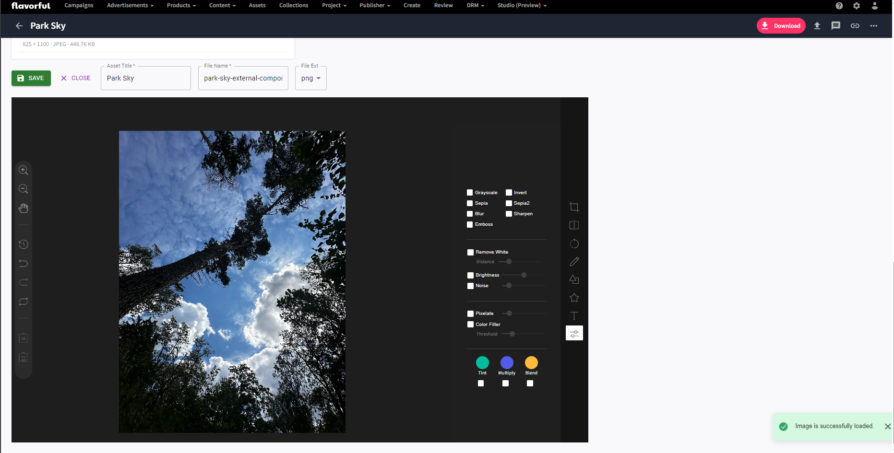

# Content Hub integration with Toast UI Image Editor and MUI

Toast UI is an image editor with an MIT license. It loads an image to a canvas and allows downloading or exporting a modified image as a base64 string. The string is later converted to `ArrayBufferUploadSource` via the `base64-arraybuffer` package and uploaded as a new asset with Content Hub's `uploadsClient`.
MUI is a front-end library that provides react components in material style. Content Hub uses it internally, so it can add visual consistency to your external components.

- [Toast UI Image Editor Main Repository](https://github.com/nhn/tui.image-editor?tab=readme-ov-file)
- [Toast UI Image Editor React Wrapper](https://github.com/nhn/tui.image-editor/tree/master/apps/react-image-editor)
- [MUI](https://mui.com/)



## Starter

The external component is based on the following [Content Hub External Components Starter](https://github.com/nvadera-sc/content-hub-external-components-starter).

## Config

Component config example:

```json
{
  "editorConfig": {
    "includeUI": {
      "theme": {
        "header.display": "none"
      },
      "menu": [
        "crop",
        "flip",
        "rotate",
        "draw",
        "shape",
        "icon",
        "text",
        "filter"
      ],
      "initMenu": "filter",
      "uiSize": {
        "width": "100%",
        "height": "800px"
      },
      "menuBarPosition": "right"
    },
    "cssMaxHeight": 700,
    "cssMaxWidth": 1000,
    "selectionStyle": {
      "cornerSize": 20,
      "rotatingPointOffset": 70
    }
  },
  "supportedFileExtensions": ["png", "jpg"],
  "modifiedFileExtensions": ["png", "jpg"]
}
```

## Additional Info

It was required to install such packages to avoid errors on ContentHubClient authorization:

```
npm install https-browserify url stream-http buffer form-data --save --force
```

Then in `webpack.config.js` the `resolve` section is modified:

```js
resolve: {
    extensions: ['.tsx', '.ts', '.jsx', '.js'],
    fallback: {
        'https': require.resolve('https-browserify'),
        'url': require.resolve('url'),
        'http': require.resolve('stream-http'),
        'buffer': require.resolve('buffer/')
    }
}
```

Also, `dotenv` is installed to store environment variables in a `.env` file.

```
npm install dotenv --save-dev --force
```

Create the `.env` file by copying and renaming the `.env.example`.
Set the `ENDPOINT` to your instance url.
`CLIENT_ID` and `CLIENT_SECRET` should be the same as configured in the oAuth configuration in Content Hub.
`CHUSERNAME` and `CHPASSWORD` should correspond to your oAuth user credentials.
